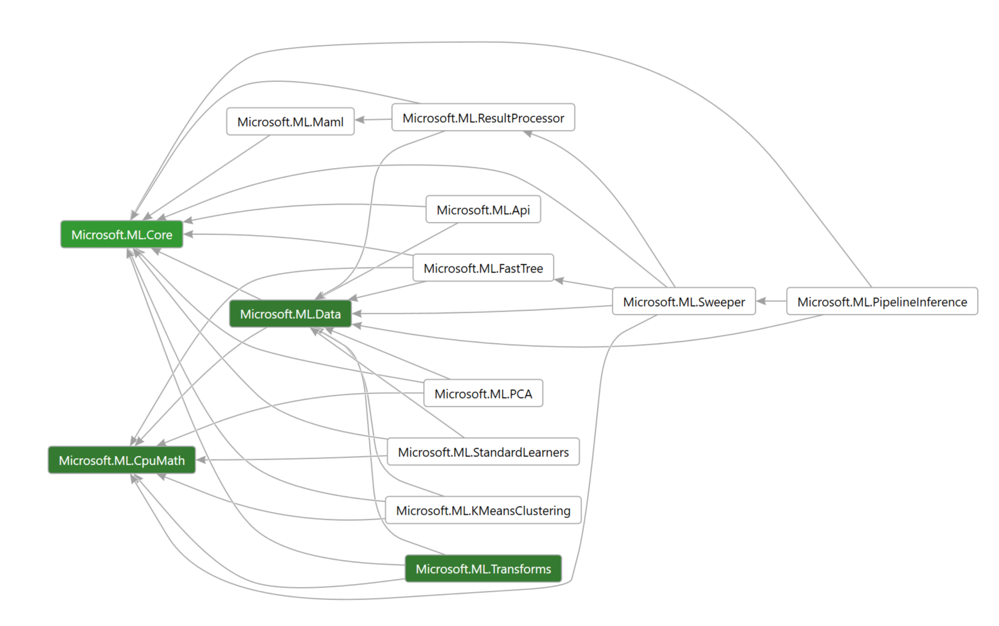

# Microsoft.ML.Core

Status: **Needs more work** | 
[API Ref](Microsoft.ML.Core.md) |
[Dependencies](Microsoft.ML_Dependencies.png) |
[Write-up](https://github.com/TomFinley/machinelearning/blob/a4511133d3c0b5bc993af22f09607945e7fdf063/docs/code/Catalog-Core.md)

We've started to review the `Microsoft.ML.Core` assembly. In this review we've
focused on the `Schema` type that provides column and metadata information for
the `IDataView` type, which is at the heart of all the data processing in
ML.NET.

## Highlevel notes

* We don't expect `Microsoft.ML.Core` to contain many customer facing types
    - `IDataView` is an exception to that
* There are currently 13 assemblies in the NuGet package (excluding the legacy
  assembly). Do we need that many assemblies?
    - Would there be gains by merging the assembly so that we can make fewer
      types public?
    - We need to think about mobile scenarios where we want to deploy only a
      subset (usually inference).
* For the upcoming reviews, we should focus our efforts on the core-ish
  assemblies (marked in green): 
* We should have few namespaces in the `Microsoft.ML.Core` assembly:
    - `Microsoft.ML`
        + Core scenario APIs
    - `Microsoft.ML.Data`
        + `IDataView`
    - Else, only if needed

## `Microsoft.ML.Runtime.Data.Schema`

```C#
 namespace Microsoft.ML.Runtime.Data {
     public sealed class Schema : ISchema {
         public Schema(IEnumerable<Schema.Column> columns);
         public int ColumnCount { get; }
         public Schema.Column this[int col] { get; }
         public Schema.Column this[string name] { get; }
         public static Schema Create(ISchema inputSchema);
         public string GetColumnName(int col);
         public Schema.Column GetColumnOrNull(string name);
         public IEnumerable<ValueTuple<int, Schema.Column>> GetColumns();
         public ColumnType GetColumnType(int col);
         public void GetMetadata<TValue>(string kind, int col, ref TValue value);
         public ColumnType GetMetadataTypeOrNull(string kind, int col);
         public IEnumerable<KeyValuePair<string, ColumnType>> GetMetadataTypes(int col);
         public bool TryGetColumnIndex(string name, out int col);
         public sealed class Column {
             public Column(string name, ColumnType type, Schema.Metadata metadata);
             public Schema.Metadata Metadata { get; }
             public string Name { get; }
             public ColumnType Type { get; }
         }
         public sealed class Metadata {
             public Metadata(IEnumerable<ValueTuple<Schema.Column, Delegate>> values);
             public Schema Schema { get; }
             public ValueGetter<TValue> GetGetter<TValue>(int col);
             public void GetValue<TValue>(string kind, ref TValue value);
             public sealed class Builder {
                 public Builder();
                 public void Add(Schema.Column column, Delegate getter);
                 public void Add(Schema.Metadata metadata, Func<string, bool> selector);
                 public void Add<TValue>(Schema.Column column, ValueGetter<TValue> getter);
                 public void AddKeyValues<TValue>(int size, PrimitiveType valueType, ValueGetter<VBuffer<TValue>> getter);
                 public void AddSlotNames(int size, ValueGetter<VBuffer<ReadOnlyMemory<char>>> getter);
                 public Schema.Metadata GetMetadata();
             }
         }
     }
 }
```

* Do we need `ISchematized`?
    - Looks nobody is consuming it
* `ISchema` will be retired
* We need a longer name for `Schema` as it's too generic
* We may want to make some of the nested types `Schema.Column` non-nested as
  they are an oddity in .NET. However, it seems there is some pattern ML where
  many types have a nested `Column` type, so maybe that's acceptable here.
* Should the columns be structs?
    - Since they aren't a function of the number of rows, they don't seem to pose
      scaling issues.
    - If sharing is more important, it should be a class.
    - If data density (array) is more important, it should be a struct.
* For V1, should the constructor be internal?
    - There seems to be desire to scope component authorship out of V1
* Schema allows for duplicated names. If you call `Schema["name"]` and multiple
  columns have the provided, it will return the last one. The rationale is that
  these columns are *hidden*. This allows for concise data transforms where
  users have the illusion that they can mutate the data when in fact they just
  add new column with the same name.
    - This might confuse people as `GetColums()` returns fewer columns than
      `ColumnCount`
    - Should `Schema.Column` have an `Index` and `IsHidden`? This poses
      construction challenges.

## Next Steps

* We need more review slots:
    - Weekly review (Thursdays)
    - 2 x four hours with lunch in between
* Review other core assemblies:
    - `Microsoft.ML.CpuMath`
    - `Microsoft.ML.Data`
    - `Microsoft.ML.Transforms`